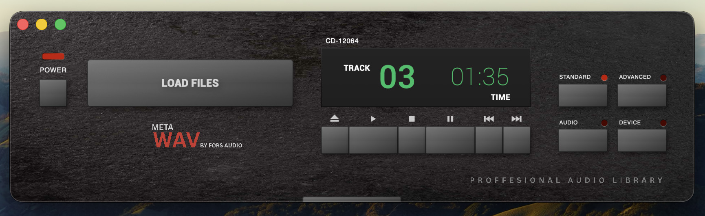
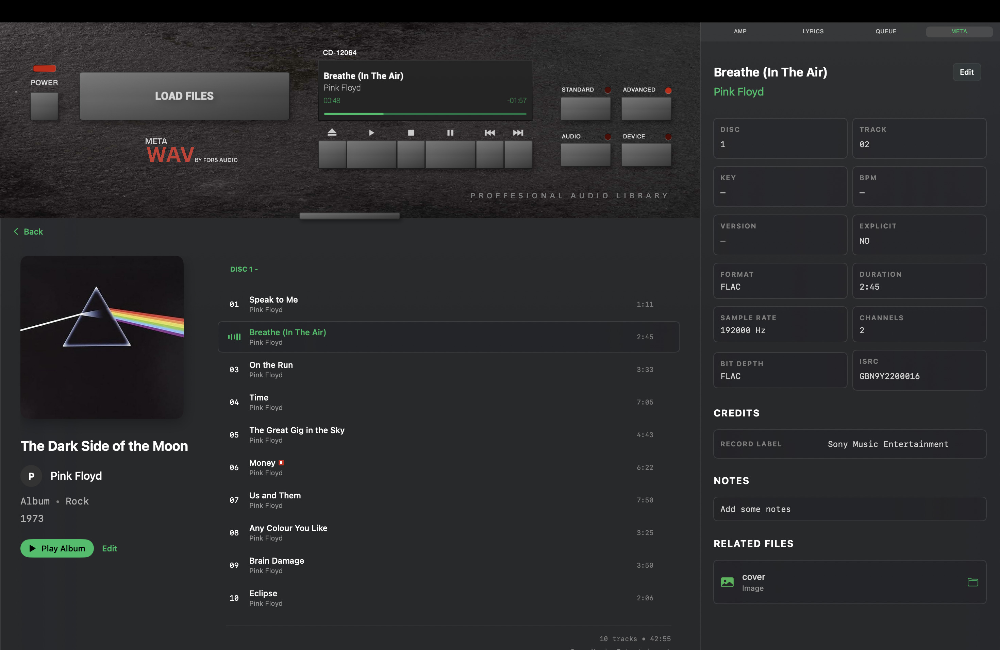
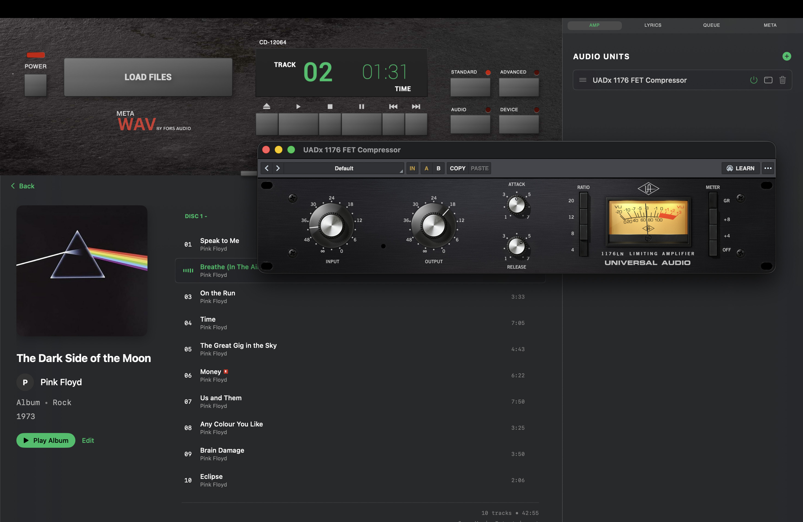

# MetaWav

MetaWav is an audio library designed for musicians, producers, and audio engineers who need precise, reliable control over their audio collections.

## Background

This project was taken on during the middle of 2025. The idea was to build a music app with a UI similar to a close family members Rotel 90's hifi stack. Initially designed in Framer, this project was then developed in Swift, using AI tools to help with the advanced elements of implementation. Button presses, clicks and various sounds were recorded from the original units to add a tactile and vintage feel to the player.

This idea evolved into being able to add additional metadata with an attached file. After various additions and changes made, the current version was mostly complete towards the end of 2025, and includes advanced metadata such as BPM, key, credits & time coded lyrics. To be able to use graphical equalisers often found in hifi stacks, adding AU plugin support became an priority. Then additional controls and library features were added such as scrubbing, playlists and artist profiles. The final touches included simple things such as highlighting on selected, indenting on hover, and implementing new Liquid Glass features from macOS Tahoe.

## Features

- **Advanced metadata** — Key, BPM, ISRC, notes, and credits across close to 40 roles, all per track
- **Timecoded lyrics** — Write, import and export lyrics with per-line timestamps that scroll in sync with the song
- **Audio Unit support** — Add AU plugins to an effects rack (Experimental Feature)
- **Sharing** - Export as a "MetaAlbum" to share both audio and full data to a new machine
- **Playlists** — Build and manage playlists, with drag-and-drop reordering
- **Lightweight File System** - Audio is not imported only read from a file path, avoiding duplication. 
- **Artist and album pages** — Browse by artist with discography

## Known Bugs
- Playback is not seamless
- Dragging to re order can cause issues such as duplicate albums
- App must be restarted after changing lyrics to sync
- Lyrics have a time delay of around 1 second
- Pops during playback when adding AU plugins
- Output device is not always reported correctly

When encountering bugs, check the troubleshooting section. If the issue is still not resolved, the best thing to do is ensure any changes have been saved and restart the app. 

## Screenshots

## Download

Latest build: [Releases](https://github.com/tomforsberg/MetaWav/releases)

MetaWav isn't signed with an Apple Developer certificate, so macOS will flag it on first launch:

1. Right-click (or Control-click) `MetaWav.app` → **Open**
2. Click **Open** again on the dialog

## License

Source-available, all rights reserved. See [LICENSE](LICENSE) — you're welcome to read the code, not redistribute it.